#Alkalmazások fejlesztése - beadandó dokumentáció - Zentai Dávid (YX063S)

<b>Házikassza kezelő alkalmazás</b>

Alkalmazás rövid leírása:
 Ezzel az alkalmazással az egy háztartásban élők nyomon tudják követni a közös kasszájuk bevételeit illetve kiadásait.

<b>Funkcionális leírás:</b>

 A szoftverrel bejelentkezés nélkül
<ul>
    <li>el tudjuk olvasni az oldal rövid bemutatását</li>
</ul>
A szoftverrel bejelentkezés után
<ul>
    <li>megtekinthetjük profilunkat</li>
    <li>módosíthatjuk jelszavunkat</li>
    <li>kilistázhatjuk a bevételeket, illetve a kiadásokat</li>
    <li>hozzáadhatunk bevételt</li>
    <li>módosíthatunk saját bevételt</li>
    <li>hozzáadhatunk, módosíthatunk és törölhetünk kiadást</li>
    <li>kiléphetünk felhasználói fiókunkból</li>
</ul>
A szoftverrel Adminisztrátori bejelentkezés után
<ul>
    <li>kilistázhatjuk a felhasználókat</li>
    <li>módosíthatjuk bármely felhasználó jelszavát</li>
    <li>törölhetünk és létrehozhatunk felhasználót</li>
    <li>kiléphetünk az adminisztrátori fiókból</li>
</ul>

<b>Nem funcionális leírás:</b>

<ul>
    <li>Felhasználóbarát, ergonomikus elrendezés és kinézet</li>
    <li>Gyors működés</li>
    <li>Biztonságos működés: jelszavak tárolása, funkciókhoz való hozzáférés</li>
</ul>
 Oldaltérkép:
 Bejelentkezés nélkül elérhető:
<ul>
    <li>Az oldal leírását tartalmazó nyitólap</li>
    <li>Bejelentkezési oldal</li>
</ul>
 Felhasználóként elérhető:
<ul>
    <li>Bevételek listázása</li>
    <ul>
        <li>Saját bevétel módosítása</li>
        <li>Bevétel hozzáadása</li>
    </ul>
    <li>Kiadások listázása</li>
    <ul>
        <li>Saját kiadás módosítása</li>
        <li>Kiadás hozzáadása</li>
        <li>Saját kiadás törlése</li>
    </ul>
    <li>Profil megtekintése</li>
    <li>Kilépés a felhasználói fiókból</li>
</ul>
 Adminisztátorként elérhető:
<ul>
    <li>Felhesználó listázása</li>
    <ul>
        <li>Felhasználó módosítása (jelszó)</li>
        <li>Felhasználó törlése</li>
        <li>Felhasználó hozzáadása</li>
    </ul>
    <li>kilépés az Admin profilból</li>
</ul>

<b>Végpontok:</b>

GET /: főoldal
 GET /login: bejelentkezési oldal
 POST /login: bejelntkezési adatok küldése
 GET /profile: profil jelszó változtatása
 POST /profile: profil jelszó módosítása
 GET /proceeds: bevételek listázása
 GET /proceeds/modify: bevétel módosítása
 POST /proceeds/modify: bevétel módosított adatainak küldése
 GET /proceeds/create: új bevétel hozzáadása
 POST /proceeds/create: új bevétel adatainak küldése
 GET /expenditure: kiadások listázása
 GET /expenditure/modify: kiadások módosítása
 POST /expenditure/modify: kiadások módosított adatainak elküldése
 GET /expenditure/create: új kiadás hozzáadása
 POST /expenditure/create: új kiadás adatainak küldése
 POST /expenditure/delete: kiadás törlése
 GET /users: felhasználók listázása
 GET /users/modify: felhasználó adatainak módosítása
 POST /users/modify: felhasználó módosított adatainak elküldése
 GET /users/create: új felhasználó hozzáadása
 POST /users/create: új felhasználó adatainak küldése
 POST /users/delete: felhasználó törlése
 POST /logout: kijelentkezés

<b>Oldalvázlatok:</b>

Főoldal:
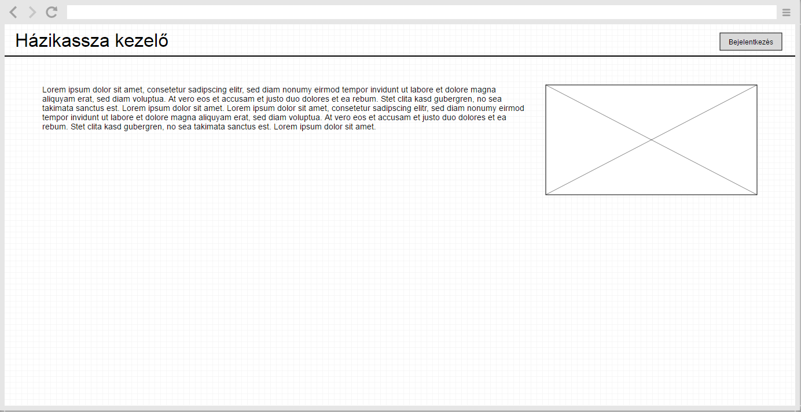
 Bejelentkezési oldal:
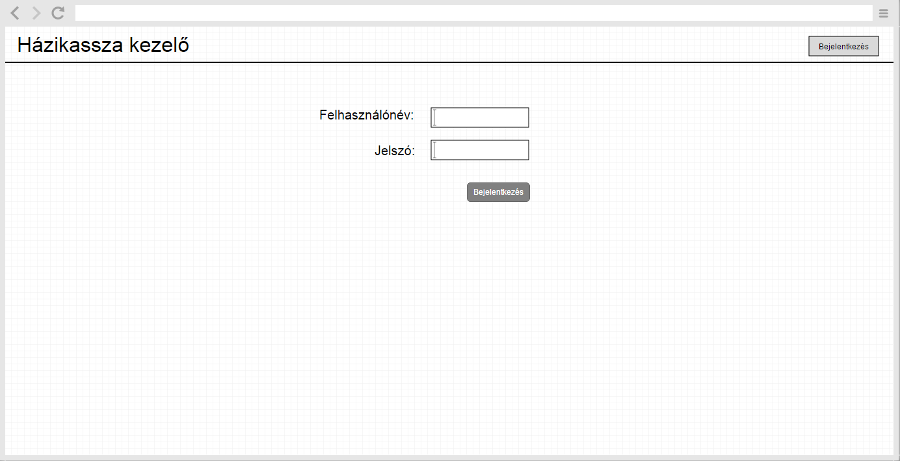
 :Bevételek:
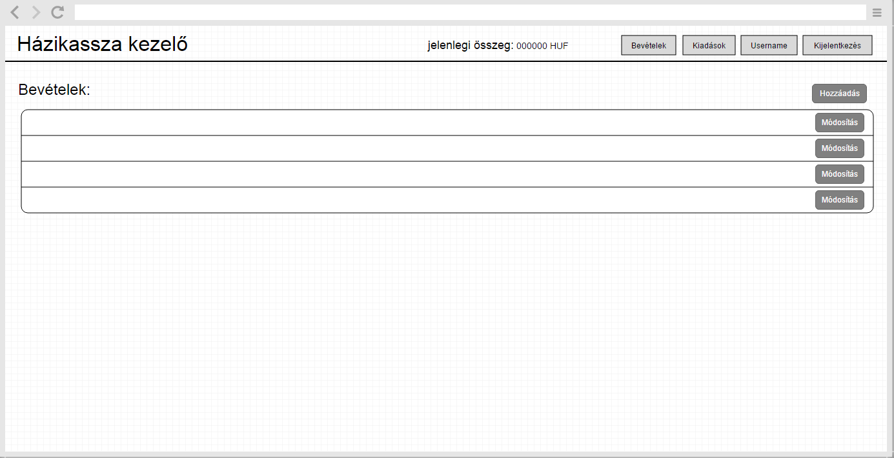
 Bevétel hozzáadása:
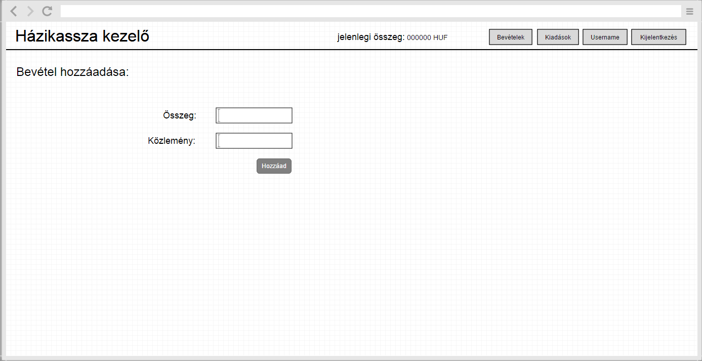
 Bevétel szerkesztése:
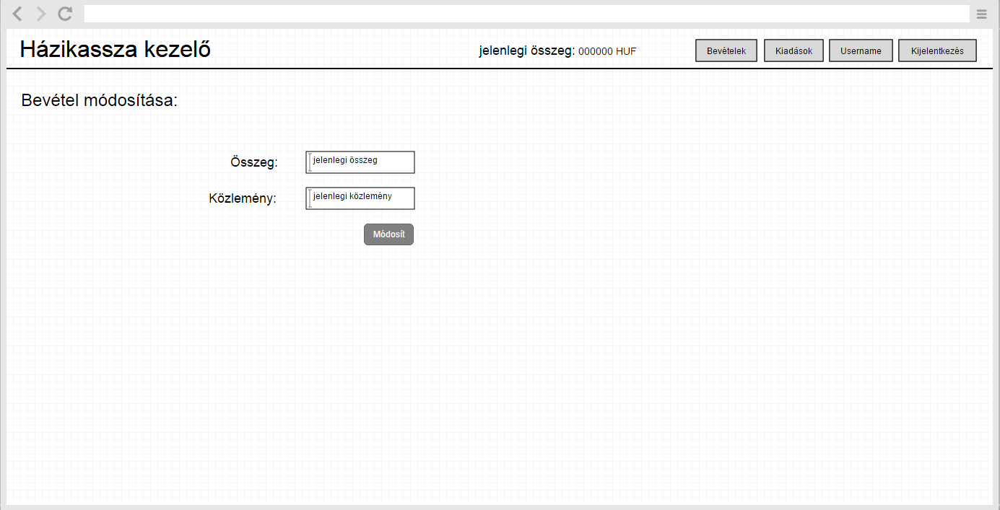
 Kiadások:
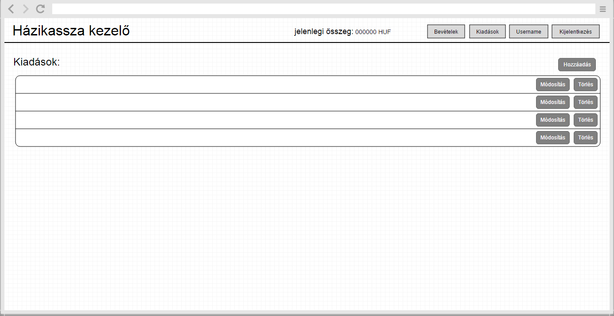
 Kiadás hozzáadása:

 Kiadás módosítása:
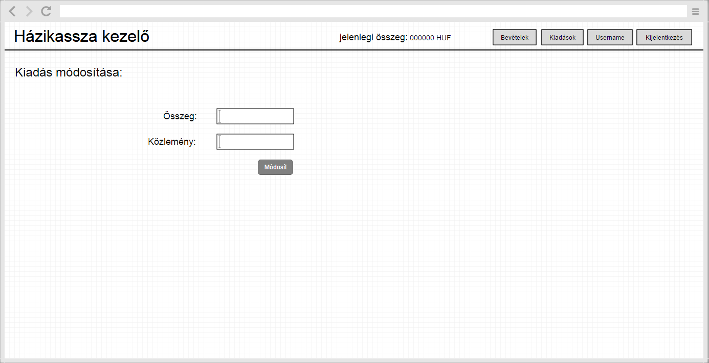
 Profil megtekintése:
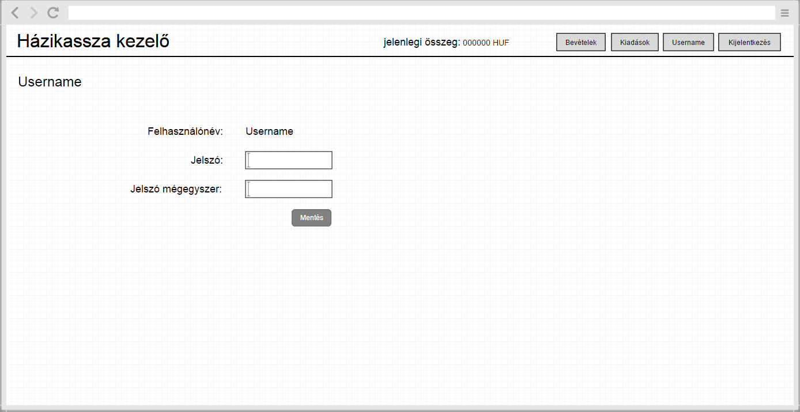
 Felhasználók listázása (Admin):
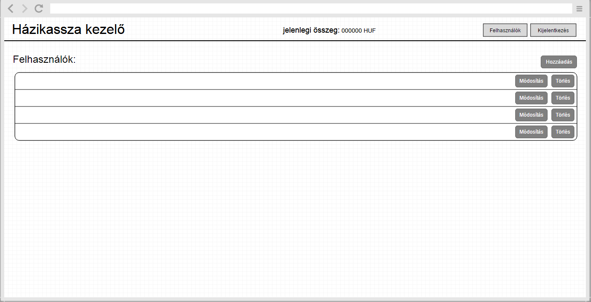
 Felhasználó hozzáadása (Admin):
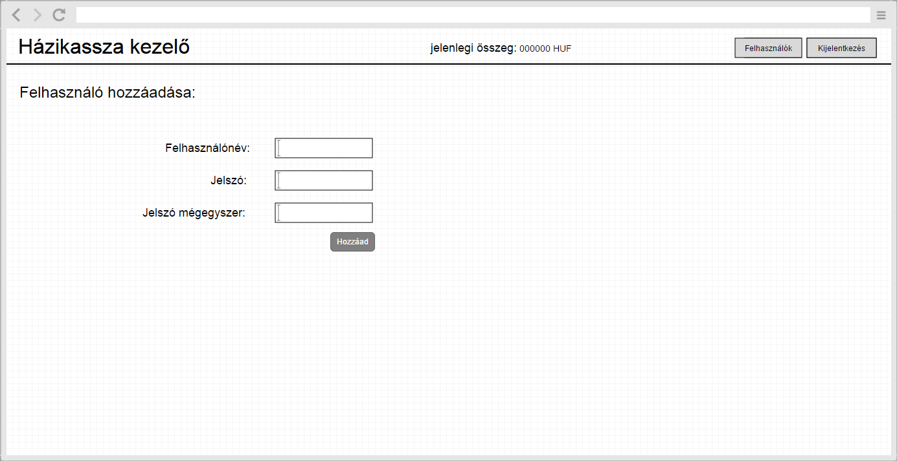
 Felhasználó módosítása (Admin):
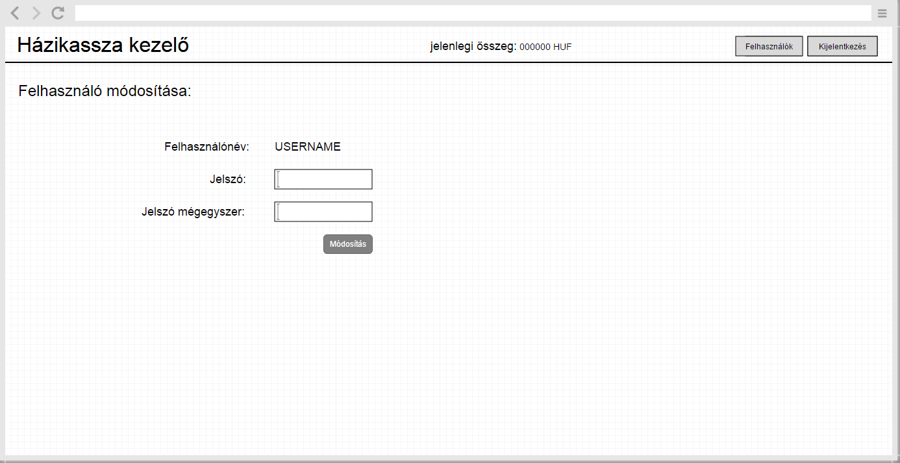

<b>Adatbázismodell</b>

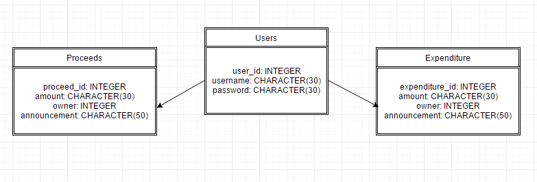